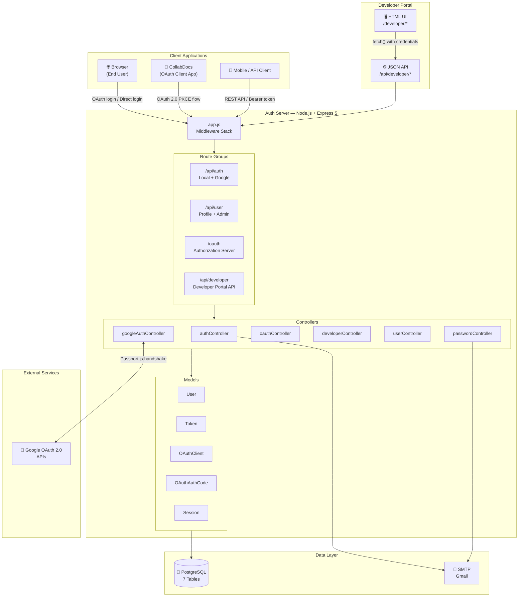
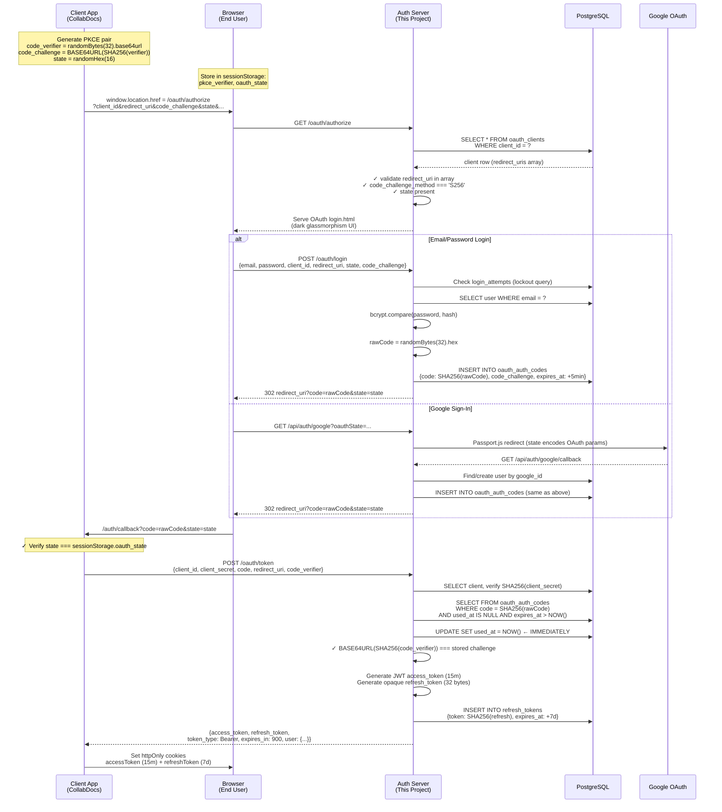
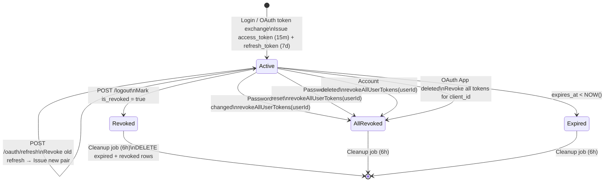
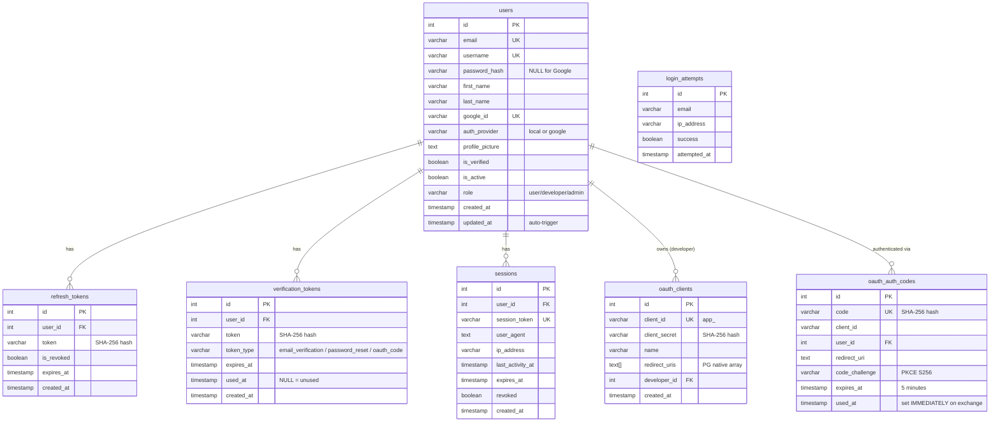
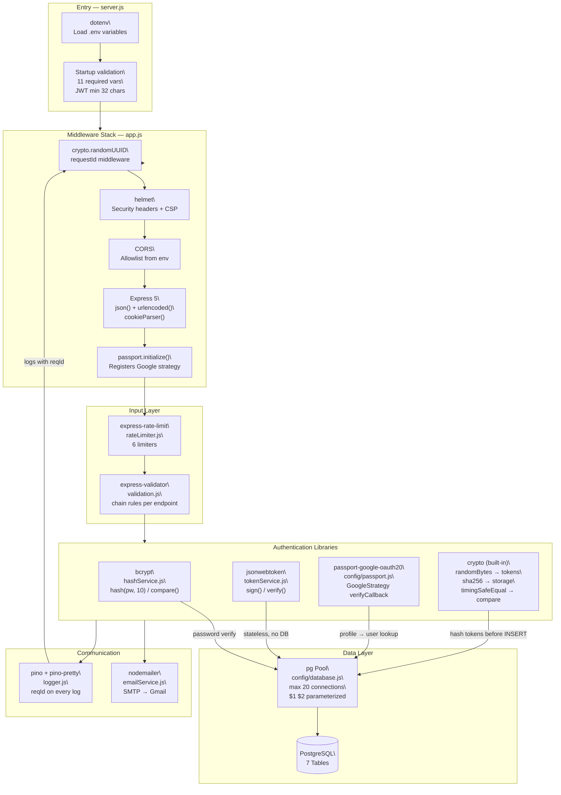

# 🔐 AuthFlow — Full-Stack Authentication Platform
### Complete Project Bible · 100% Read · Interview Preparation Guide

---

> **Everything in this document comes from reading every single file in the codebase.**  
> Written in first person so you can speak it directly in interviews.  
> Read it out loud. Own the words. This is your project.

---

## ⚡ Elevator Pitches

---

### 🕐 30-Second Elevator Pitch

> "I built a production-grade authentication platform from scratch — no Auth0, no Firebase, no shortcuts. It's a Node.js/Express backend that implements the full OAuth 2.0 Authorization Code flow with PKCE, a dual-token JWT system with automatic rotation, Google Sign-In via Passport.js, a complete Developer Portal where third-party devs can register OAuth apps, a full HTML email system with branded templates, and a comprehensive test suite using Jest and Supertest. Everything is backed by PostgreSQL, protected by layered rate limiting, and structured to be the kind of auth server other applications plug into — like a self-hosted Auth0."

---

### 🕑 2-Minute Standard Interview Answer

> "I built a full authentication platform from the ground up. The core idea was to build something that functions like Auth0 or Keycloak — meaning other applications can use it as their identity provider — but I built every single piece myself so I actually understand what's happening under the hood.
>
> On the tech side, I used Node.js with Express 5, PostgreSQL as the database with the `pg` driver, and JWT for stateless authentication. The system has two authentication paths: local email/password login, and Google Sign-In via OAuth 2.0 with Passport.js.
>
> The most technically interesting part is the OAuth 2.0 Authorization Server I built. When a third-party application wants to authenticate users through my system, it initiates an Authorization Code flow with PKCE — which is the modern, secure way to do OAuth without exposing tokens in the URL. The client generates a random code verifier, hashes it with SHA-256, sends the hash in the authorization request, and then proves ownership at the token exchange by sending the original verifier. My server recomputes the hash and compares them using a constant-time comparison to prevent timing attacks.
>
> For tokens, I use a dual-token architecture. Access tokens are short-lived JWTs — 15 minutes — and refresh tokens are long-lived opaque tokens stored hashed in the database. Every time a refresh token is used, I rotate it: I revoke the old one and issue a new pair.
>
> I also built a complete Developer Portal — a full web UI where developers can register their applications, get their client credentials, and manage their OAuth apps. The client secret is only shown once at creation time and is always stored as a SHA-256 hash.
>
> I have a full integration test suite using Jest and Supertest with in-memory database mocks. The server also does startup validation of required environment variables, enforces minimum JWT secret length, and runs a background cleanup job every 6 hours.
>
> This was built as the auth backbone for a collaborative document editing app — CollabDocs — which uses this system as its identity provider."

---

### 🕔 5-Minute Deep Dive Answer

> "Let me walk you through the full system architecture.
>
> **What it is:** I built an authentication server — think of it as a self-hosted Auth0 or Keycloak. Other applications connect to it rather than managing their own auth. It was built specifically to be the identity provider for CollabDocs, my collaborative Markdown editor — but it's designed to serve any number of client applications.
>
> **The stack:** Node.js with Express 5, PostgreSQL with the `pg` driver using a connection pool (max 20 connections), JWT via `jsonwebtoken`, Passport.js for Google OAuth, bcrypt with cost factor 10 for password hashing, Nodemailer for HTML email, Pino for structured JSON logging with pino-pretty in dev, Helmet.js for security headers, `express-rate-limit` for rate limiting, and `express-validator` for input validation. I used ES Modules throughout — `import/export` — so the codebase is modern. PM2 runs it in cluster mode in production.
>
> **The database:** I designed seven tables with a security-first principle — nothing sensitive is ever stored raw.
>
> `users` is the central table. It has `password_hash` which is nullable — Google OAuth users have null passwords. It has `google_id`, `auth_provider` (local or google), `profile_picture` URL, `is_verified`, `is_active`, and `role`. A PostgreSQL trigger auto-updates `updated_at` on every row change. There's an index on `google_id` and `auth_provider` for the Passport.js lookups.
>
> `refresh_tokens` stores SHA-256 hashed tokens with `is_revoked` boolean and `expires_at`. Raw tokens never touch the database.
>
> `verification_tokens` is a multi-purpose table — it handles email verification tokens, password reset tokens, and the one-time OAuth exchange codes for Google login. All stored hashed. Every query checks `used_at IS NULL AND expires_at > NOW()`.
>
> `sessions` tracks active sessions with `session_token`, `user_agent`, `ip_address`, `last_activity_at`, and a `revoked` flag. The Session model has create, findByToken, findByUserId, updateActivity, and deleteExpired operations.
>
> `login_attempts` has a composite index on `(email, success, attempted_at DESC)` — that's the exact access pattern of the lockout query so it's maximally efficient.
>
> `oauth_clients` stores registered third-party apps with `client_id` (like `app_4ba2201d2a9f3ebf`), `client_secret` as SHA-256 hash, `name`, `redirect_uris` as a PostgreSQL `TEXT[]` native array, and `developer_id` as a foreign key.
>
> `oauth_auth_codes` stores one-time codes as SHA-256 hashes with `code_challenge` for PKCE, `expires_at` (5 minutes), and `used_at` which is set immediately when the code is presented at the token endpoint.
>
> **The OAuth 2.0 PKCE flow step by step:** A third-party app generates a cryptographically random code verifier. It hashes that with SHA-256 and base64url-encodes it to get the code challenge. It sends an authorization request to my `/oauth/authorize` endpoint. My server validates the client_id, checks the redirect_uri against the whitelist, and serves a beautiful dark-mode glassmorphism login page built with vanilla CSS and Lucide icons. The user can log in with email/password or click 'Continue with Google'. My server issues a 5-minute single-use authorization code — stored hashed — and redirects to the client's redirect_uri. The client sends the code plus the original code verifier to my `/oauth/token` endpoint. I mark the code as used IMMEDIATELY — before verifying PKCE — to prevent any replay window. Then I recompute SHA-256 of the verifier and compare it to the stored challenge using `crypto.timingSafeEqual`. If it matches, I issue a JWT access token and an opaque refresh token.
>
> **The JWT system:** Access tokens expire in 15 minutes and contain `{ id, email, role }`. My `authenticateToken` middleware checks both `req.cookies.accessToken` (httpOnly cookie) and `Authorization: Bearer` header so it serves both browser and non-browser clients. Refresh tokens are 7-day opaque tokens, SHA-256 hashed before storage, rotated on every use.
>
> **Google Sign-In:** In direct mode, I generate a one-time `oauth_code` type token in the `verification_tokens` table, redirect the browser with just that code, and the frontend exchanges it via a POST. Tokens never appear in redirect URLs. In OAuth provider mode — when a user clicks Google Sign-In on my OAuth login page while authenticating for a third-party app — the OAuth params are bundled into the Passport state, and after Google auth, I generate a regular OAuth auth code and redirect to the third-party app's redirect_uri.
>
> **The email system:** I built HTML email templates from scratch using inline CSS — the right way to do emails so they render in all clients. I have three templates: a verification email with a 'Verify Email Address' button, a password reset email with a 'Reset Password' button (1-hour expiry warning), and a welcome email triggered after successful verification. The templates use a consistent purple gradient brand style. The auth server itself serves the forgot-password and reset-password HTML pages — same dark glassmorphism design as the OAuth login.
>
> **The test suite:** I wrote a full integration test suite using Jest and Supertest. It uses `jest.unstable_mockModule` to mock both the database pool and the email service, so tests run without any real database or SMTP server. I test every endpoint: health check, register (201, email conflict, username conflict, weak password, invalid email), login (wrong credentials, missing fields, account lockout 429), logout, verify email, forgot password (email enumeration prevention), reset password, resend verification, Google exchange, profile GET/PUT, change password, delete account, and the admin user list endpoint. 18 test suites in a single 557-line test file.
>
> **Security infrastructure:** Rate limiting at 6 tiers. Account lockout. SHA-256 for all token and secret storage. `timingSafeEqual` for secret comparison. Email enumeration prevention. CORS allowlist. Helmet with tuned CSP. Open-redirect prevention in every redirect. Single-use auth codes marked immediately. `X-Request-Id` header on every response. A `create-limited-user.sql` script to set up a least-privilege database user with only SELECT/INSERT/UPDATE/DELETE on specific tables — no superuser access. Startup refuses to boot without required env vars or if JWT secrets are under 32 characters.
>
> **The Developer Portal UI:** I built it in vanilla HTML/CSS/JS, no framework. It has a dark glassmorphism design consistent with the auth pages. The dashboard shows apps as cards with the client_id displayed in a monospace badge. When you register a new app, the credentials appear in a modal overlay with a copy button and a warning — 'Save your Client Secret now — it will never be shown again.' The client-detail page shows the app info in section cards, the redirect URIs as pill tags, a Rotate button that shows a rotation modal with the new secret, and a Danger Zone section for deletion. All modals use backdrop blur and prevent the user from closing before acknowledging they've saved their credentials.
>
> **The production setup:** PM2 cluster mode — `instances: 'max'` spawns one worker per CPU core. 512MB memory restart limit. Logs go to `./logs/out.log` and `./logs/error.log`. There are Windows startup scripts — a `.bat` file and a `.ps1` PowerShell script — in the `servers/` folder. The PowerShell script kills existing node processes, prints server info, and starts with `npm run dev`."

---

---

## 📋 1. What This Project Is

I built a **complete authentication server** — the kind that other applications connect to instead of building their own login system. It functions like a self-hosted Auth0 or Keycloak.

**The real-world use case I built it for:** I have another project — CollabDocs, a real-time collaborative Markdown editor. Instead of building auth inside CollabDocs, I built this auth server first, then converted CollabDocs into a pure OAuth 2.0 client that redirects users to this server for login.

It serves three audiences:
- **End users** — sign in with email/password or Google
- **Third-party developers** — register OAuth apps and use this server as their identity provider  
- **The admin** — manage users, roles, and the system

---

## 🛠️ 2. Every Technology Used and WHY

| Technology | Why I Chose It |
|---|---|
| **Node.js + Express 5** | Express 5 propagates async errors automatically — uncaught async throws reach the error handler without try/catch everywhere. I used it because of this, plus the ecosystem |
| **PostgreSQL + pg** | ACID transactions, relational integrity (foreign keys for cascade deletes), and native `TEXT[]` type for storing redirect_uris arrays — no JSON serialization needed |
| **pg connection pool** | Configured with `max: 20`, `idleTimeoutMillis: 30000`, `connectionTimeoutMillis: 5000`. Pool errors are logged but non-fatal — transient errors can recover |
| **jsonwebtoken** | Separate secrets for access vs refresh so compromising one doesn't compromise the other. `accessTokenSecret()` and `refreshTokenSecret()` are functions (not constants) so they're read fresh from env each time |
| **bcrypt (cost factor 10)** | Deliberately slow — 10 rounds. This is the standard production value. Makes brute-force expensive even with modern hardware |
| **passport + passport-google-oauth20** | Abstracts the Google OAuth handshake — redirect, token exchange, profile fetch — while giving me full control over what happens after (account creation, linking, token issuance) |
| **helmet** | Sets X-Frame-Options, X-Content-Type-Options, HSTS, and a tuned CSP in one call |
| **express-rate-limit** | Per-route granularity with `skipSuccessfulRequests: true` on login — legitimate users never burn their quota on successful logins |
| **nodemailer** | SMTP delivery with HTML templates. Email delivery failures are non-fatal and don't roll back the operation |
| **pino + pino-pretty** | Fastest Node.js logger. Structured JSON in production (log aggregation ready), pretty-printed colored output in development — controlled by `LOG_LEVEL` env var |
| **express-validator** | Declarative validation chain API — validates email format, password strength (uppercase, lowercase, digit, special char), username (3-30 chars, alphanumeric + _ -), and sanitizes all string inputs |
| **crypto (built-in)** | `randomBytes` for CSPRNG tokens, `createHash('sha256')` for token storage, `timingSafeEqual` for constant-time secret comparison |
| **dotenv** | Env vars managed externally. Startup validation checks required vars exist and refuses to boot if they're missing |
| **PM2** | Cluster mode with `instances: 'max'` — one worker per CPU core. 512MB memory restart. 10 max restarts. Pino logs piped to log files for PM2 log rotation |
| **Lucide Icons** | Used in all HTML views (OAuth login page, Developer Portal pages, forgot/reset password pages) via CDN — consistent SVG icon set |
| **Inter font (Google Fonts)** | Used in all HTML views — modern, clean sans-serif for the dark glassmorphism UI design |
| **Jest + Supertest** | Full integration test suite. `jest.unstable_mockModule` mocks both the database pool and email service so tests need no real infrastructure |

---

## ✅ 3. Every Feature I Built

### Core Authentication
- User registration with email/password, username, optional first_name and last_name
- Email verification — new users receive a branded HTML email, must verify before login
- Login with dual-token issuance (JWT access + opaque refresh)
- Logout with active token revocation
- Refresh token rotation — every refresh call issues a completely new pair and revokes the old one
- Resend verification email — invalidates old tokens first, issues new one
- Forgot password — email enumeration protected, returns same response for known/unknown emails
- Reset password form served directly from the auth server (branded HTML page)
- Reset password with token (SHA-256 hashed, 1-hour expiry)
- `validate-reset-token` endpoint — frontend can check if a token is still valid before showing the form
- Change password — requires current password, revokes all other sessions on success
- Account deletion — revokes all tokens before deleting account
- Profile get (returns public fields only, no password_hash)
- Profile update (name, username — checks for username conflicts)

### Google Sign-In
- Google OAuth 2.0 via Passport.js (profile + email scopes)
- Auto-creates account if Google email is new — username auto-generated from email prefix + 3-byte hex suffix
- Account linking — if email already exists as local account, links Google ID to it
- One-time code exchange pattern — tokens never appear in redirect URLs (security)
- Open-redirect prevention — every redirectUrl validated against `ALLOWED_ORIGINS` allowlist
- Google Sign-In inside the OAuth flow — works as an identity option on the OAuth login page for third-party apps
- Google auth failure handler at `/api/auth/google/failure`

### OAuth 2.0 Authorization Server
- Full Authorization Code flow with mandatory PKCE (S256 only — other methods rejected)
- State parameter enforcement — required, prevents CSRF attacks
- Authorization codes: 32 bytes random → stored as SHA-256 hash → 5-minute expiry → single-use
- OAuth login page — beautiful dark glassmorphism HTML with Google button, email/password form, hidden fields carrying OAuth params, password toggle, error display, forgot-password and register links
- OAuth register page — users can create an account directly from the OAuth login flow
- Token endpoint with full PKCE verification (constant-time comparison)
- Refresh endpoint with token rotation
- Userinfo endpoint (OpenID Connect inspired — returns id, email, username, name, role, profile_picture, is_verified)
- Token revocation endpoint — marks refresh token `is_revoked = true`
- Strict redirect URI whitelisting — never redirects on invalid client_id or redirect_uri
- Error display back on login page on failure — preserves all hidden OAuth fields

### Developer Portal (Full Web UI)
- Developer account upgrade flow (any user → developer role)
- OAuth app registration — generates `client_id` (`app_` + 8 bytes hex) and `client_secret` (32 bytes random hex)
- Client secret shown once at registration in a modal overlay with copy buttons and "Save now — never shown again" warning
- List all registered apps as cards with client_id badge and creation date
- App detail page with Credentials section (client_id + copy button, secret shown as dots with Rotate button), Redirect URIs as pill tags, App Info section, and Danger Zone
- Secret rotation — shows new secret in modal, old secret immediately invalidated
- App deletion — deletes from `oauth_clients`, all related tokens revoked
- Full HTML web UI (5 pages: login, register, dashboard, new-client, client-detail)
- Client-side auth check — pages call the API and redirect to `/developer/login` if 401
- Sticky glassmorphism navbar on dashboard and client-detail pages

### User Management
- Get own profile (password_hash excluded from response)
- Update profile (first_name, last_name, username)
- Change password (blocked for Google-only accounts — returns error "Google account, no password to change")
- Delete account
- Admin paginated user listing — page + limit params, capped at 100, returns `{ users, pagination: { page, limit, total } }`

### Email System
- Branded HTML email templates using inline CSS (renders in all email clients)
- Purple-to-indigo gradient header, white card body, gray footer
- Verification email: "Verify Email Address" CTA button + raw link fallback, 24h expiry mention
- Password reset email: "Reset Password" CTA button, 1h expiry warning, security notice
- Welcome email: sent after successful verification — "Welcome, {firstName}! 🎉" with personalization
- SMTP transport via nodemailer (Gmail by default, configurable)
- Email failures are non-fatal — operation succeeds even if email can't be sent

### Security Infrastructure
- 6-tier rate limiting (global 100/15min, register 10/15min, login 20/15min failures-only, password-reset 5/15min, verify-resend 5/15min, oauth-exchange 10/15min)
- Account lockout — 5 failed attempts in 15 minutes triggers lockout, response includes exact seconds remaining
- Request ID middleware — honours upstream `X-Request-Id` (Nginx, Cloudflare) or generates UUID, echoes it in `X-Request-Id` response header
- Global error handler — recognises PostgreSQL error codes (23505 unique, 23503 FK, 23502 not null, 22P02 invalid text) and JWT error types (JsonWebTokenError, TokenExpiredError), maps them to appropriate HTTP status codes. Includes stack trace in development mode only.
- `notFound` handler — logs 404s with path, method, and IP
- `uncaughtException` and `unhandledRejection` global handlers in server.js
- Graceful shutdown — SIGTERM/SIGINT handlers drain DB pool cleanly
- Background cleanup job — every 6 hours, purges: expired verification tokens, expired refresh tokens, expired oauth auth codes, and login_attempts older than 30 days
- Startup environment validation — 11 required vars checked. JWT secrets must be ≥32 chars or server refuses to start.
- Least-privilege database user — `create-limited-user.sql` script creates an `auth_app` PostgreSQL user with only SELECT/INSERT/UPDATE/DELETE on specific tables
- `restore-client.mjs` — utility script to restore a known OAuth client's hashed secret after a database reset (used during development of CollabDocs integration)

### Test Suite
- Full integration tests using Jest + Supertest (557 lines, `tests/api.test.js`)
- Mocks: `jest.unstable_mockModule` for `database.js` (shared `mockQuery` fn) and `emailService.js`
- Test helper functions: `makeUser()`, `makeTokenRecord()`, `makeAccessToken()`, `sha256()`
- Test coverage:
  - `GET /api/health` (DB connected, DB disconnected)
  - `POST /api/auth/register` (success, email conflict, username conflict, weak password, invalid email)
  - `POST /api/auth/login` (wrong credentials, missing fields, account lockout 429)
  - `POST /api/auth/logout` (with cookie, without cookie)
  - `GET /api/auth/verify/:token` (valid token, invalid token)
  - `POST /api/auth/forgot-password` (unknown email returns 200 with generic message, known email sends email, missing email 400)
  - `POST /api/auth/reset-password` (invalid token, valid token, weak password)
  - `POST /api/auth/resend-verification` (unknown email, already verified, unverified user)
  - `POST /api/auth/google/exchange` (missing code, invalid code, valid code)
  - `GET /api/user/profile` (no token, authenticated, user deleted)
  - `PUT /api/user/profile` (no token, update name, update username free, username taken, no fields, username too short)
  - `PUT /api/user/change-password` (no token, user not found, Google account no password)
  - `DELETE /api/user/delete-account` (no token, success, user not found)
  - `GET /api/user/users` (no token, non-admin, admin success, limit cap at 100)

### DevOps and Scripts
- `ecosystem.config.cjs` — PM2 cluster config with `instances: 'max'`, 512MB memory limit, 3s restart delay, 10 max restarts, log files at `./logs/out.log` and `./logs/error.log`
- `servers/start-server.bat` — Windows batch script to start dev server
- `servers/start-server.ps1` — PowerShell script that kills existing node processes, prints server info, starts `npm run dev`
- `GOOGLE_OAUTH_FIX.txt` — self-documenting setup guide for adding Google Cloud Console redirect URIs (with common mistakes listed)
- `src/database/create-limited-user.sql` — least-privilege PostgreSQL user setup
- `src/database/migrations/003_oauth_provider.sql` — migration that added `role` column, `oauth_clients`, `oauth_auth_codes` tables
- `src/database/google-auth-migration.sql` — migration that added `google_id`, `auth_provider`, `profile_picture` columns and made `password_hash` nullable
- `src/db/reseed.sql` — re-seed script to restore the developer account and CollabDocs OAuth client after a database reset

---

## 🏗️ 4. System Architecture End to End

### 4.1 — High-Level System Architecture



---

### 4.2 — Request Lifecycle (Every HTTP Request)

```mermaid
flowchart LR
    REQ(["Incoming Request"])
    REQ --> RID["requestId\nAttach UUID\nX-Request-Id header"]
    RID --> HELM["Helmet\nSecurity headers\nCSP, HSTS, X-Frame"]
    HELM --> CORS["CORS Check\nAllowlist validation\n(ALLOWED_ORIGINS)"]
    CORS --> RATE["Rate Limiter\nPer-route quota\nIP-based"]
    RATE --> VALID["express-validator\nInput validation\nSanitization"]
    VALID --> AUTH_MW{"Auth\nRequired?"}
    AUTH_MW -->|"Yes"| JWT["authenticateToken\nCookie OR Bearer header\njwt.verify()"]
    AUTH_MW -->|"No"| ROLE
    JWT --> ROLE{"Role\nRequired?"}
    ROLE -->|"Yes"| RBAC["requireRole()\nCheck user.role"]
    ROLE -->|"No"| CTRL
    RBAC --> CTRL["Controller\nBusiness Logic"]
    CTRL --> MODEL["Model\nParameterized SQL\n$1, $2 placeholders"]
    MODEL --> DB[("PostgreSQL")]
    DB --> LOG["Pino Logger\nStructured JSON\nwith req.id"]
    LOG --> RES(["Response"])

    CTRL -->|"throws"| ERR["errorHandler\nPostgreSQL code mapping\nJWT error mapping"]
    ERR --> RES
```



---

### 4.3 — Route Map

```mermaid
flowchart TD
    SERVER["server.js\nPort 3000"] --> APP["app.js"]

    APP --> API["/api"]
    APP --> OAUTH["/oauth"]
    APP --> DEV["/developer"]
    APP --> DEVAPI["/api/developer"]

    API --> AUTH["/api/auth"]
    API --> USER["/api/user"]
    API --> HEALTH["/api/health"]

    AUTH --> A1["POST /register"]
    AUTH --> A2["POST /login"]
    AUTH --> A3["POST /logout"]
    AUTH --> A4["POST /refresh"]
    AUTH --> A5["GET /verify/:token"]
    AUTH --> A6["POST /resend-verification"]
    AUTH --> A7["POST /forgot-password"]
    AUTH --> A8["POST /reset-password"]
    AUTH --> A9["GET /google"]
    AUTH --> A10["GET /google/callback"]
    AUTH --> A11["POST /google/exchange"]

    USER --> U1["GET /profile"]
    USER --> U2["PUT /profile"]
    USER --> U3["PUT /change-password"]
    USER --> U4["DELETE /delete-account"]
    USER --> U5["GET /users 🔒admin"]

    OAUTH --> O1["GET /authorize"]
    OAUTH --> O2["GET /register"]
    OAUTH --> O3["POST /login"]
    OAUTH --> O4["POST /token"]
    OAUTH --> O5["POST /refresh"]
    OAUTH --> O6["GET /userinfo 🔒bearer"]
    OAUTH --> O7["POST /revoke"]

    DEV --> D1["GET / dashboard.html"]
    DEV --> D2["GET /login login.html"]
    DEV --> D3["GET /register register.html"]
    DEV --> D4["GET /new new-client.html"]
    DEV --> D5["GET /clients/:id detail.html"]

    DEVAPI --> DA1["POST /register"]
    DEVAPI --> DA2["POST /clients 🔒dev"]
    DEVAPI --> DA3["GET /clients 🔒dev"]
    DEVAPI --> DA4["POST /clients/:id/rotate 🔒dev"]
    DEVAPI --> DA5["DELETE /clients/:id 🔒dev"]
```



---

## 🔒 5. OAuth 2.0 PKCE Flow — Step by Step

PKCE = Proof Key for Code Exchange. Implemented from RFC 7636.



**Why PKCE matters:** Without it, intercepting the auth code in the redirect URL lets an attacker exchange it for tokens. With PKCE, the code is useless without the code verifier — which never left the client device.

---

## 🎟️ 6. JWT Access Token and Refresh Token System

### Access Tokens
- **Format:** JWT, HMAC-SHA256 signed, payload: `{ id, email, role }`
- **Secret:** `JWT_ACCESS_SECRET` (min 32 chars, validated at startup)
- **Expiry:** `JWT_ACCESS_EXPIRY` (default 15m)
- **Verification:** Stateless — `jwt.verify()` only, no DB hit
- **Delivery:** httpOnly cookie (`accessToken`) AND JSON response body (`accessToken` key)
- **Reading:** `authenticateToken` middleware checks cookie first, then `Authorization: Bearer` header

### Refresh Tokens
- **Format:** 32 bytes cryptographic random → hex string (opaque, not a JWT)
- **Secret:** `JWT_REFRESH_SECRET` (separate from access secret)
- **Expiry:** `JWT_REFRESH_EXPIRY` (default 7d)
- **Storage:** SHA-256 hex hash in `refresh_tokens.token` — raw token never in DB
- **Rotation:** Every use → revoke old → issue new pair

### Token Lifecycle Diagram



### Cookie Settings
```javascript
{
  httpOnly: true,                          // JS can't read — XSS protection
  secure: NODE_ENV === 'production',       // HTTPS only in production
  sameSite: NODE_ENV === 'production' ? 'none' : 'lax',  // 'none' for cross-domain OAuth
  path: '/',
}
```
`sameSite: 'none'` is correct for this use case — it's a multi-project auth server, so cookies must work cross-domain.

### Token Lifecycle Table
| Event | What Happens |
|---|---|
| Login | New access + refresh token pair issued |
| Refresh | Old refresh revoked (`is_revoked = true`), new pair issued |
| Logout | Specific refresh token revoked, cookies cleared |
| Password change | ALL refresh tokens for that user revoked |
| Password reset | ALL refresh tokens revoked (force re-login everywhere) |
| Account deletion | ALL refresh tokens revoked before user deleted |
| Cleanup job (6h) | Expired rows purged from `refresh_tokens` |

---

## 🌐 7. Google Sign-In Integration

### Mode 1: Direct Login
1. Frontend hits `GET /api/auth/google?redirectUrl=<safe_frontend_url>`
2. My server validates `redirectUrl` against `ALLOWED_ORIGINS` (open-redirect prevention)
3. Passport.js state = `{ mode: 'direct', redirectUrl: <validated_url> }`
4. Google OAuth handshake happens
5. Callback: look up by `google_id` → link or create account
6. **Token-safe redirect:** Generate `oauth_code` type token in `verification_tokens` (hashed, 5 min)
7. Redirect: `{frontend}/auth/google/callback?code=<rawCode>`
8. Frontend calls `POST /api/auth/google/exchange { code }` 
9. Server marks code used, issues JWT + refresh tokens, returns in body + sets cookies

### Mode 2: OAuth Provider Flow (Google inside OAuth flow)
When user clicks Google on the OAuth login page:
1. Google link is built with OAuth params: `/api/auth/google?oauthState=<encoded_oauth_params>`
2. State = `{ mode: 'oauth', oauthParams: <original_query_string> }`
3. After Google auth: decode state, generate OAuth auth code, redirect to third-party app's redirect_uri

### Account Linking Logic
```javascript
let user = await User.findByGoogleId(profile.id);        // 1. Look up by google_id
if (!user) {
  const existing = await User.findByEmail(email);         // 2. Check email conflict
  if (existing) {
    user = await User.updateById(existing.id, {           // 3. Link Google to existing
      google_id: profile.id,
      auth_provider: 'google',
      is_verified: true,
    });
  } else {
    // Auto-generate username from email prefix + 3-byte hex suffix
    // Retry with UUID suffix on collision
    user = await User.create({                            // 4. Create new account
      ..., password_hash: null, is_verified: true
    });
  }
}
```

Google-only accounts have `password_hash = null`. The change-password endpoint detects this and returns a 400 with "Google account, no password to change."

---

## 🛡️ 8. Every Security Measure

### 1. Password Hashing — bcrypt cost 10
`hashPassword` uses `bcrypt.hash(password, 10)`. Cost 10 = ~100ms on modern hardware. Makes brute-force computationally expensive even after a DB breach.

### 2. Token/Secret Storage — SHA-256, Never Raw
Every sensitive value stored in the database is SHA-256 hashed:
- Refresh tokens → `refresh_tokens.token`
- Verification/reset tokens → `verification_tokens.token`
- OAuth auth codes → `oauth_auth_codes.code`
- Client secrets → `oauth_clients.client_secret`

### 3. Timing-Safe Comparison — `crypto.timingSafeEqual`
Used when verifying client secrets:
```javascript
const computed = Buffer.from(sha256(rawSecret), 'hex');
const stored   = Buffer.from(client.client_secret, 'hex');
return crypto.timingSafeEqual(computed, stored);
```
A normal `===` exits early on the first differing byte — attackers can measure the time difference to guess secrets byte by byte. `timingSafeEqual` always takes the same time.

### 4. Multi-Tier Rate Limiting
| Limiter | Limit | Scope |
|---|---|---|
| `apiLimiter` (global) | 100 req/15min | All `/api/*` routes |
| `registerLimiter` | 10/15min | Registration endpoint |
| `loginLimiter` | 20/15min (failures only) | Login endpoint |
| `passwordResetLimiter` | 5/15min | Forgot password |
| `resendVerificationLimiter` | 5/15min | Resend verification |
| `oauthExchangeLimiter` | 10/15min | Google code exchange |

### 5. Account Lockout
5 failed logins within 15 minutes → account locked. `login_attempts` table with composite index `(email, success, attempted_at DESC)` — exact query access pattern. Response: `429 { error: "Too many failed attempts. Try again in X seconds." }`.

### 6. Email Enumeration Prevention
Forgot password endpoint: returns `"If that email is registered, a password reset link has been sent."` regardless of whether the email exists. Same for resend verification — same generic response whether email found or not. Verified in the test suite.

### 7. CORS with Origin Allowlist
CORS origin validated against `ALLOWED_ORIGINS` (comma-separated env) + `FRONTEND_URL`. Also allows `null` origin for server-to-server calls (Node.js `undici` fetch sends `origin: null`).

### 8. HTTP Security Headers via Helmet
Tuned CSP — allows `'self'`, Google Fonts CDN, Lucide CDN (for OAuth/Developer Portal HTML pages), and Google's OAuth scripts.

### 9. OAuth Redirect URI Whitelisting
`/oauth/authorize` validates `redirect_uri` against `client.redirect_uris` (the PostgreSQL array). If `client_id` or `redirect_uri` is invalid, server returns an error page and **never redirects** — per OAuth spec, to prevent attackers using an invalid redirect_uri to steal auth codes from the error redirect.

### 10. Single-Use Auth Codes + Immediate Marking
```javascript
// In token endpoint — BEFORE PKCE verification:
await OAuthAuthCode.markAsUsed(rawCode);
// Then verify PKCE — even if PKCE fails, code is already consumed
```
This prevents any replay window.

### 11. State Parameter (CSRF)
Required on every authorization request. Client stores it in `sessionStorage`, verifies it matches when the code comes back.

### 12. Request ID Tracing
```javascript
req.id = req.headers['x-request-id'] || randomUUID();
res.setHeader('X-Request-Id', req.id);
```
Honours upstream proxy IDs. Enables full request lifecycle tracing in log aggregators.

### 13. Startup Security Validation
```javascript
// From server.js — refuses to boot:
const REQUIRED_ENV = ['DB_HOST', 'DB_PORT', ...]; // 11 required vars
// JWT secrets must be ≥32 characters
```

### 14. Input Validation and Sanitization
`express-validator` chains on every endpoint. Custom `validators.js`:
- `isValidEmail` — regex
- `isStrongPassword` — requires uppercase, lowercase, digit, special char (`@$!%*?&`), min 8 chars
- `isValidUsername` — 3-30 chars, alphanumeric + _ and -
- `sanitizeInput` — trims and removes `<` and `>` (XSS basic sanitization)
- `sanitizeClientUrl` — validates URL origin against allowlist before any redirect

### 15. httpOnly Cookie + Bearer Header Dual Support
```javascript
// authenticateToken middleware:
const token = req.cookies?.accessToken
           || req.headers.authorization?.split(' ')[1];
```
Browser apps use the httpOnly cookie (JS can't read it — XSS resistant). Mobile and server-to-server clients use the Authorization header.

### 16. Comprehensive Token Revocation
- Logout: revokes the specific session's refresh token
- Password change: `revokeAllUserTokens(userId)` — revokes everything
- Password reset: `revokeAllUserTokens(userId)` — forces re-login everywhere
- Account deletion: `revokeAllUserTokens(userId)` before deleting user row
- App deletion: marks all related `refresh_tokens` `is_revoked = true`

### 17. Least-Privilege Database User
`create-limited-user.sql` sets up an `auth_app` PostgreSQL user with only `SELECT, INSERT, UPDATE, DELETE` on specific tables. No superuser access, no DDL permissions. ALTER DEFAULT PRIVILEGES ensures new tables get the same grants automatically.

### 18. PostgreSQL Error Mapping
The global error handler maps raw PostgreSQL error codes to HTTP responses:
- `23505` (unique violation) → 409 Conflict
- `23503` (foreign key violation) → 400 Bad Request
- `23502` (not null violation) → 400 Bad Request
- `22P02` (invalid text representation) → 400 Bad Request

---

## 🖥️ 9. How the Developer Portal Works

### Architecture
The Developer Portal has two route sets in `app.js`:
- `/developer/*` — HTML page routes (served by Express as static-ish HTML files)
- `/api/developer/*` — JSON API routes (authenticated with JWT + developer role)

### Page Design
All 5 Developer Portal pages use the same design system:
- Dark background (`#060818`)
- Glassmorphism cards (`rgba(255,255,255,0.03)` + `backdrop-filter: blur`)
- Purple-indigo gradient (`#6c63ff` to `#8b5cf6`) for primary actions
- Sticky navbar with blur backdrop
- Radial gradient ambient light effects (decorative `::before`/`::after` pseudo-elements)
- Lucide icons throughout
- Inter font from Google Fonts

### User Flow
1. User registers at `/developer/register` (calls the regular auth API)
2. Logs in at `/developer/login` (calls regular auth API, gets httpOnly cookies)
3. On first visit to `/developer`, calls `POST /api/developer/register` to upgrade role to `developer`
4. Dashboard loads apps via `GET /api/developer/clients`
5. Clicks "Register New App" → `/developer/new`
6. Submits name + redirect URIs → `POST /api/developer/clients`
7. Server generates `client_id` = `'app_' + crypto.randomBytes(8).toString('hex')`
8. Server generates `client_secret` = `crypto.randomBytes(32).toString('hex')`
9. Server stores `SHA256(client_secret)` — never the raw secret
10. Response includes raw `{ client_id, client_secret }`
11. Dashboard shows **a modal overlay** with client_id and client_secret, copy buttons, and "Save now — never shown again" warning
12. Secret is stored in `sessionStorage('new_client_credentials')` temporarily, read on dashboard load, then immediately removed

### Secret Rotation (client-detail.html)
- "Rotate" button clicks → `POST /api/developer/clients/:id/rotate`
- Server: verifies ownership, generates new secret, stores new SHA-256 hash, returns raw secret once
- Page shows rotation modal with new secret and copy button
- Old secret immediately stops working

### Ownership Enforcement
Every developer API endpoint verifies the requesting user owns the app:
```javascript
// Only returns apps where developer_id = req.user.id
const clients = await OAuthClient.findByDeveloperId(req.user.id);
// For rotate/delete: checks client.developer_id === req.user.id
```

---

## 🗄️ 10. Database Structure and Why

### Schema Design Principles
1. Nothing sensitive stored raw — all tokens, secrets, codes SHA-256 hashed
2. Indexes on every column used in primary `WHERE` clauses
3. Cascade deletes — `ON DELETE CASCADE` on all foreign keys to users
4. PostgreSQL-native types — `TEXT[]` for redirect_uris (no JSON serialization)
5. Audit timestamps — `created_at` (default NOW) and `updated_at` (auto-updated by trigger)

### Entity Relationship Diagram



### Table Details

#### `users`
```sql
id              SERIAL PRIMARY KEY
email           VARCHAR(255) UNIQUE NOT NULL
username        VARCHAR(100) UNIQUE
password_hash   VARCHAR(255)             -- NULL for Google-only accounts
first_name      VARCHAR(100)
last_name       VARCHAR(100)
google_id       VARCHAR(255) UNIQUE      -- links Google identity
auth_provider   VARCHAR(50) DEFAULT 'local'  -- 'local' or 'google'
profile_picture TEXT                     -- URL from Google profile
is_verified     BOOLEAN DEFAULT FALSE    -- must be true to log in (local only)
is_active       BOOLEAN DEFAULT TRUE     -- admin can deactivate
role            VARCHAR(20) DEFAULT 'user'  -- 'user', 'developer', 'admin'
created_at      TIMESTAMP DEFAULT NOW()
updated_at      TIMESTAMP DEFAULT NOW()  -- auto-updated by trigger

Indexes: email, google_id, auth_provider
Trigger: set_updated_at BEFORE UPDATE
```

#### `refresh_tokens`
```sql
id          SERIAL PRIMARY KEY
user_id     INTEGER REFERENCES users(id) ON DELETE CASCADE
token       VARCHAR(500) NOT NULL    -- SHA-256 hex hash, never raw
is_revoked  BOOLEAN DEFAULT FALSE    -- soft delete for audit trail
expires_at  TIMESTAMP NOT NULL
created_at  TIMESTAMP DEFAULT NOW()

Index: token (for hash lookups)
```

#### `verification_tokens`
```sql
id          SERIAL PRIMARY KEY
user_id     INTEGER REFERENCES users(id) ON DELETE CASCADE
token       VARCHAR(255) NOT NULL    -- SHA-256 hex hash
token_type  VARCHAR(50) NOT NULL     -- 'email_verification', 'password_reset', 'oauth_code'
expires_at  TIMESTAMP NOT NULL       -- 24h (verify), 1h (reset), 5min (oauth_code)
used_at     TIMESTAMP                -- NULL = unused, set when consumed
created_at  TIMESTAMP DEFAULT NOW()

Queries always: WHERE token = SHA256(raw) AND used_at IS NULL AND expires_at > NOW()
```

#### `sessions`
```sql
id               SERIAL PRIMARY KEY
user_id          INTEGER REFERENCES users(id) ON DELETE CASCADE
session_token    VARCHAR(255) UNIQUE NOT NULL
user_agent       TEXT
ip_address       VARCHAR(50)
last_activity_at TIMESTAMP DEFAULT NOW()
expires_at       TIMESTAMP
revoked          BOOLEAN DEFAULT FALSE
created_at       TIMESTAMP DEFAULT NOW()
```

#### `login_attempts`
```sql
id           SERIAL PRIMARY KEY
email        VARCHAR(255) NOT NULL
ip_address   VARCHAR(100)
success      BOOLEAN NOT NULL
attempted_at TIMESTAMP DEFAULT NOW()

Composite indexes:
  (email, success, attempted_at DESC)      -- for lockout window query
  (ip_address, attempted_at DESC)          -- for IP-based analysis
```

#### `oauth_clients`
```sql
id             SERIAL PRIMARY KEY
client_id      VARCHAR(100) UNIQUE NOT NULL   -- 'app_<16 hex chars>'
client_secret  VARCHAR(255) NOT NULL          -- SHA-256 hashed, NEVER raw
name           VARCHAR(100) NOT NULL
redirect_uris  TEXT[] NOT NULL               -- PostgreSQL native array
developer_id   INTEGER REFERENCES users(id) ON DELETE CASCADE
created_at     TIMESTAMP DEFAULT NOW()

Indexes: client_id, developer_id
```

#### `oauth_auth_codes`
```sql
id              SERIAL PRIMARY KEY
code            VARCHAR(255) UNIQUE NOT NULL   -- SHA-256 hashed
client_id       VARCHAR(100) NOT NULL
user_id         INTEGER REFERENCES users(id) ON DELETE CASCADE
redirect_uri    TEXT NOT NULL
code_challenge  VARCHAR(255)                   -- PKCE S256 challenge
expires_at      TIMESTAMP NOT NULL             -- 5 minutes
used_at         TIMESTAMP                      -- set IMMEDIATELY on exchange

Indexes: code, client_id
```

### Migration History
The schema evolved in stages:
1. Base schema: `users`, `refresh_tokens`, `verification_tokens`, `sessions`, `login_attempts`
2. `google-auth-migration.sql`: Added `google_id`, `auth_provider`, `profile_picture` to users; made `password_hash` nullable
3. `003_oauth_provider.sql`: Added `role` column to users; created `oauth_clients` and `oauth_auth_codes` tables

---

## 📁 11. Complete Project Structure

```
app-backend/
├── server.js                         # Entry: env validation, DB init, startup, graceful shutdown, cleanup jobs
├── ecosystem.config.cjs              # PM2 cluster mode (max workers, 512MB limit, log files)
├── package.json                      # Dependencies + scripts
├── .env.example                      # All 15 required/optional vars documented
├── GOOGLE_OAUTH_FIX.txt             # Setup guide for Google Cloud Console redirect URIs
├── restore-client.mjs               # Utility: restore CollabDocs OAuth client's hashed secret
├── servers/
│   ├── start-server.bat             # Windows batch file to start dev server
│   └── start-server.ps1            # PowerShell: kill node processes, print info, start server
├── tests/
│   └── api.test.js                 # 557-line Jest + Supertest integration test suite
├── logs/                           # PM2 log output directory
└── src/
    ├── app.js                       # Express: CORS, Helmet, route mounting, static files
    ├── config/
    │   ├── database.js              # pg Pool init (lazy singleton), SSL support, connection events
    │   ├── passport.js              # Google OAuth strategy (Passport.js), account linking logic
    │   ├── email.js                 # SMTP config (nodemailer transport)
    │   └── jwt.js                  # JWT config functions (read fresh from env each call)
    ├── controllers/
    │   ├── authController.js        # register, login, logout, refresh, verifyEmail, resendVerification
    │   ├── passwordController.js    # forgotPassword, validateResetToken, resetPassword
    │   ├── googleAuthController.js  # googleCallback, exchangeGoogleCode
    │   ├── oauthController.js       # authorize, registerPage, handleLogin, token, refresh, userinfo, revoke
    │   ├── developerController.js   # registerAsDeveloper, createClient, listClients, rotateSecret, deleteClient + page handlers
    │   └── userController.js        # getUserProfile, updateUserProfile, changeUserPassword, deleteUserAccount, getAllUsers
    ├── models/
    │   ├── User.js                  # findById, findByEmail, findByUsername, findByGoogleId, create, updateById, delete, getAllUsers
    │   ├── Token.js                 # createRefreshToken, findRefreshToken, revokeRefreshToken, revokeAllUserTokens, createVerificationToken, findVerificationToken, markTokenAsUsed, deleteExpiredTokens, createOAuthCode
    │   ├── OAuthClient.js           # create, findByClientId, findByDeveloperId, updateSecret, deleteByClientId, verifySecret
    │   ├── OAuthAuthCode.js         # create, findByCode, markAsUsed, deleteExpired
    │   └── Session.js               # createSession, findByToken, findByUserId, updateActivity, deleteSession, deleteExpiredSessions
    ├── middlewares/
    │   ├── auth.js                  # authenticateToken, authorizeRoles, requireRole
    │   ├── rateLimiter.js           # apiLimiter, registerLimiter, loginLimiter, passwordResetLimiter, resendVerificationLimiter, oauthExchangeLimiter
    │   ├── validation.js            # express-validator chains for every endpoint
    │   ├── requestId.js             # UUID per request, honours X-Request-Id, echoes in response
    │   └── errorHandler.js          # notFound + errorHandler (PostgreSQL + JWT error code mapping)
    ├── services/
    │   ├── tokenService.js          # generateAccessToken, generateRefreshToken, verifyAccessToken
    │   ├── hashService.js           # hashPassword (bcrypt 10), comparePassword
    │   ├── emailService.js          # sendVerificationEmail, sendPasswordResetEmail, sendWelcomeEmail
    │   └── authService.js           # DEPRECATED — all logic moved to controllers
    ├── utils/
    │   ├── pkce.js                  # verifyPKCE (RFC 7636), hashToken (SHA-256 hex)
    │   ├── logger.js                # Pino instance with dev/prod transport switching
    │   ├── generators.js            # generateRandomToken, generateOTP, generateUserName
    │   └── validators.js            # isValidEmail, isStrongPassword, isValidUsername, sanitizeInput, sanitizeObject, sanitizeClientUrl
    ├── database/
    │   ├── schema.sql               # Full schema: 7 tables + indexes + updated_at trigger
    │   ├── init.js                  # readFileSync schema.sql → pool.query()
    │   ├── google-auth-migration.sql # Added google_id, auth_provider, profile_picture; nullable password_hash
    │   ├── create-limited-user.sql  # Least-privilege PostgreSQL user setup
    │   └── migrations/
    │       └── 003_oauth_provider.sql  # Added role column, oauth_clients, oauth_auth_codes
    ├── db/
    │   └── reseed.sql               # Re-seed: developer account + CollabDocs OAuth client
    ├── routes/
    │   ├── index.js                 # Combines auth + user + google under /api (+ global rate limiter + health check)
    │   ├── auth.js                  # /register, /login, /logout, /refresh, /verify/:token, /resend-verification, /forgot-password, /reset-password, /validate-reset-token
    │   ├── googleAuth.js            # /google, /google/callback, /google/exchange, /google/failure
    │   ├── oauth.js                 # /authorize, /register, /login, /token, /refresh, /userinfo, /revoke
    │   ├── developer.js             # HTML page routes at /developer/*
    │   ├── developer-api.js         # JSON API routes at /api/developer/*
    │   └── user.js                  # /profile (GET/PUT), /change-password, /delete-account, /users (admin)
    ├── views/
    │   ├── oauth/
    │   │   ├── login.html           # OAuth login page (glassmorphism, Google button, email/password form, Lucide icons)
    │   │   └── register.html        # User registration during OAuth flow
    │   ├── developer/
    │   │   ├── login.html           # Developer Portal login
    │   │   ├── register.html        # Developer Portal registration
    │   │   ├── dashboard.html       # App list (cards with client_id badge, modal for new app secret)
    │   │   ├── new-client.html      # Register new OAuth app form
    │   │   └── client-detail.html   # App detail: credentials, redirect URIs, rotate modal, danger zone
    │   ├── forgot-password.html     # Forgot password form (auth server hosted, AJAX submit)
    │   └── reset-password.html      # Password reset form
    └── templates/
        ├── emailTemplates.js         # verificationEmailTemplate, passwordResetEmailTemplate, welcomeEmailTemplate
        ├── verificationEmail.html    # (Legacy HTML template)
        ├── resetPassword.html        # (Legacy HTML template)
        └── welcomeEmail.html         # (Legacy HTML template)
```

---

## 🚀 12. What Makes This Project Technically Impressive

1. **Full OAuth 2.0 Authorization Server** — most developers only ever build the client side. I built the server.

2. **PKCE from RFC 7636** — correct SHA-256, base64url encoding, constant-time comparison. I understand every byte of the flow.

3. **Refresh Token Rotation** — many tutorials use refresh tokens without rotation. Mine are rotated on every use — stolen tokens become invalid after one legitimate use.

4. **Nothing sensitive in the database is raw** — passwords, refresh tokens, verification tokens, reset tokens, OAuth codes, client secrets — all SHA-256 hashed. A full database dump gives attackers nothing useful.

5. **Timing-Safe Comparison** — `crypto.timingSafeEqual` prevents timing side-channel attacks on secret verification.

6. **Two-mode Google Integration** — works as both a standalone login AND as an identity option inside the OAuth provider flow. Most tutorials only do one.

7. **One-time Code Exchange Pattern** — tokens never appear in redirect URLs, preventing them from appearing in browser history, server access logs, and Referrer headers.

8. **Auth Codes Marked Used BEFORE PKCE Verification** — even if PKCE fails, the code can't be replayed. This is the correct implementation per the spec.

9. **Email Enumeration Prevention** — verified in the test suite. The test confirms that both registered and unregistered emails get identical 200 responses with the same generic message.

10. **Least-Privilege Database Access** — I have a SQL script that provisions a restricted database user. This is something most tutorials never mention.

11. **Production Infrastructure** — PM2 cluster mode, structured JSON logging, startup env validation, uncaughtException/unhandledRejection guards, graceful shutdown, 6-hour background cleanup, Windows startup scripts for quick dev server launch.

12. **Full Integration Test Suite** — 18 test suites, DB and email mocked with jest.unstable_mockModule, tests all edge cases including account lockout 429, email enumeration protection, Google-only account password change protection, and admin pagination limit cap.

13. **Built for a Real Integration** — this wasn't built in a vacuum. It was designed specifically to be the auth provider for CollabDocs, with a complete implementation plan showing how CollabDocs converts from internal auth to OAuth client.

---

## ⚖️ 13. How It Compares to Auth0, Firebase Auth, and Keycloak

| Feature | My Project | Auth0 | Firebase Auth | Keycloak |
|---|---|---|---|---|
| **OAuth 2.0 AS** | ✅ Full | ✅ Yes | ❌ No | ✅ Yes |
| **PKCE (required)** | ✅ S256 required | ✅ Yes | N/A | ✅ Yes |
| **JWT Access Tokens** | ✅ Custom claims | ✅ Yes | ✅ Yes | ✅ Yes |
| **Refresh Token Rotation** | ✅ Every use | ✅ Yes | ✅ Yes | ✅ Yes |
| **Google Sign-In** | ✅ Yes | ✅ Yes | ✅ Yes | ✅ Yes |
| **Developer Portal** | ✅ Built from scratch | ✅ Dashboard | ❌ Limited | ✅ Admin UI |
| **Email Verification** | ✅ HTML templates | ✅ Yes | ✅ Yes | ✅ Yes |
| **Password Reset** | ✅ Auth-server-hosted pages | ✅ Yes | ✅ Yes | ✅ Yes |
| **Account Lockout** | ✅ 5 attempts, time-remaining | ✅ Yes | ⚠️ Limited | ✅ Yes |
| **Rate Limiting** | ✅ 6-tier granular | ✅ Automatic | ✅ Automatic | ⚠️ Config-heavy |
| **Test Suite** | ✅ Jest + Supertest (557 lines) | N/A | N/A | N/A |
| **Self-hosted** | ✅ Fully | ❌ SaaS | ❌ SaaS | ✅ Yes |
| **Vendor lock-in** | ✅ None | ❌ High | ❌ High | ✅ None |
| **Cost at scale** | ✅ Free | ❌ $$$$ | ⚠️ Free tier | ✅ Free |
| **I understand every line** | ✅ Yes | ❌ Black box | ❌ Black box | ❌ Black box |
| **Runtime overhead** | ✅ Node.js (lean) | Cloud | Cloud | ❌ Java (500MB+) |

**The honest tradeoff:** Auth0, Firebase, and Keycloak have years of battle-hardening against real-world attack patterns I haven't encountered yet. What I built demonstrates deep understanding of exactly the same concepts and algorithms — which is the whole point for interviewing.

---

## 🔧 Running the Project

```bash
cd app-backend
npm install
cp .env.example .env
# Fill in .env with your values (see Required Env Vars below)
npm run dev     # Development with hot reload

# OR production:
npm install -g pm2
pm2 start ecosystem.config.cjs --env production
pm2 save && pm2 startup  # Auto-restart on reboot
```

### Windows Quick Start
```powershell
# From the servers/ folder:
.\start-server.ps1    # Kills existing node, starts dev server
# OR double-click start-server.bat
```

### Required Environment Variables (11 required)
```env
DB_HOST=localhost
DB_PORT=5432
DB_USER=postgres
DB_PASSWORD=your_password
DB_NAME=auth_db

JWT_ACCESS_SECRET=<64+ random chars>   # min 32, server refuses to start otherwise
JWT_REFRESH_SECRET=<64+ random chars>  # min 32, different from access secret

EMAIL_HOST=smtp.gmail.com
EMAIL_PORT=587
EMAIL_USER=your@email.com
EMAIL_PASSWORD=your_app_password

FRONTEND_URL=http://localhost:5173
AUTH_SERVER_URL=http://localhost:3000
ALLOWED_ORIGINS=http://localhost:5173

GOOGLE_CLIENT_ID=<from Google Cloud Console>
GOOGLE_CLIENT_SECRET=<from Google Cloud Console>
GOOGLE_CALLBACK_URL=http://localhost:3000/api/auth/google/callback
```

### Running Tests
```bash
npm test
# Jest + Supertest, no database needed, all mocked
```

---

## 📡 Complete API Reference

### Auth (`/api/auth`)
| Method | Endpoint | Auth | Description |
|---|---|---|---|
| POST | `/register` | — | Register new user, send verification email |
| POST | `/login` | — | Login, returns JWT + refresh token |
| POST | `/logout` | — | Revoke refresh token, clear cookies |
| POST | `/refresh` | — | Rotate refresh token |
| GET | `/verify/:token` | — | Verify email address |
| POST | `/resend-verification` | — | Resend verification email (email-enumeration safe) |
| POST | `/forgot-password` | — | Request password reset (email-enumeration safe) |
| POST | `/validate-reset-token` | — | Check if reset token is valid |
| POST | `/reset-password` | — | Reset password with token |
| GET | `/google` | — | Initiate Google OAuth |
| GET | `/google/callback` | — | Google OAuth callback |
| POST | `/google/exchange` | — | Exchange one-time code for tokens |
| GET | `/google/failure` | — | Google auth failure handler |

### User (`/api/user`)
| Method | Endpoint | Auth | Description |
|---|---|---|---|
| GET | `/profile` | ✅ | Get own profile (no password_hash) |
| PUT | `/profile` | ✅ | Update first_name, last_name, username |
| PUT | `/change-password` | ✅ | Change password (blocked for Google accounts) |
| DELETE | `/delete-account` | ✅ | Delete account + revoke all tokens |
| GET | `/users` | ✅ Admin | Paginated user list |

### Health Check (`/api`)
| Method | Endpoint | Auth | Description |
|---|---|---|---|
| GET | `/health` | — | DB ping, uptime, env, version |

### OAuth 2.0 (`/oauth`)
| Method | Endpoint | Auth | Description |
|---|---|---|---|
| GET | `/authorize` | — | Validate params, render login.html |
| GET | `/register` | — | Render registration page for OAuth flow |
| POST | `/login` | — | OAuth login form handler |
| POST | `/token` | Client creds | Exchange code for tokens |
| POST | `/refresh` | Client creds | Rotate OAuth refresh token |
| GET | `/userinfo` | ✅ Bearer | Get user profile |
| POST | `/revoke` | Client creds | Revoke refresh token |

### Developer Portal API (`/api/developer`)
| Method | Endpoint | Auth | Description |
|---|---|---|---|
| POST | `/register` | ✅ | Upgrade account to developer role |
| POST | `/clients` | ✅ Dev | Create OAuth app |
| GET | `/clients` | ✅ Dev | List own apps (no secrets) |
| POST | `/clients/:id/rotate` | ✅ Dev | Rotate client secret |
| DELETE | `/clients/:id` | ✅ Dev | Delete app |

---

## 🔬 14. How Each Library Works — Internals + Connections

> This section explains what every major library does under the hood in my project and exactly how they talk to each other. Read this before any technical interview.

---

### 🛂 Passport.js — How It Works

**What Passport is:** A middleware library for Node.js that handles authentication strategies. A "strategy" is a plugin that knows how to authenticate using one specific method — local password, Google, GitHub, etc.

**In my project, I only use one strategy:** `passport-google-oauth20`.

**Exactly what happens step by step:**

```
1. passport.initialize() — called in app.js
   This registers Passport as Express middleware.
   It adds req._passport to every request object.
   Without this, nothing works.

2. passport.use(new GoogleStrategy({...}, verifyCallback))
   Called in config/passport.js on server startup.
   This registers the Google strategy with 3 pieces of config:
     - clientID: from GOOGLE_CLIENT_ID env
     - clientSecret: from GOOGLE_CLIENT_SECRET env
     - callbackURL: 'http://localhost:3000/api/auth/google/callback'
   
   verifyCallback = async (accessToken, refreshToken, profile, done) => {
     // accessToken  = Google's token to read user's Google data
     // refreshToken = Google's refresh (we don't store this)
     // profile      = Google user object (id, emails, photos, displayName)
     // done         = callback we call to tell Passport what user was found
     
     // My code:
     // 1. Look up by google_id
     // 2. If not found, check by email (linking)
     // 3. If still not found, create new user
     // 4. Call done(null, user) — success
     // 5. Call done(err) — failure
   }

3. passport.authenticate('google', { scope: ['profile', 'email'], state: ... })
   Called when user hits GET /api/auth/google
   This tells Express: redirect this user to Google's OAuth URL.
   Google shows "Sign in with Google" consent screen.
   scope: ['profile', 'email'] = what data I'm requesting from Google.
   state = base64-encoded JSON I pass through Google (arrives back in callback)
           Used to know if this is a direct login or OAuth provider flow.

4. Google redirects back to: GET /api/auth/google/callback
   passport.authenticate('google', { failureRedirect: '/failure' })
   Passport intercepts this, extracts the `code` from query params,
   exchanges it with Google for tokens + user profile,
   runs my verifyCallback with the profile,
   and calls req.user = whatever I passed to done()

5. My googleCallback controller runs after:
   - Reads mode from decoded state
   - If mode === 'direct': issues one-time code, redirects to frontend
   - If mode === 'oauth': issues OAuth auth_code, redirects to client redirect_uri
```

**What Passport does NOT do in my project:**
- It does NOT manage sessions (`passport.session()` is NOT called — stateless JWT design)
- It does NOT issue tokens
- It does NOT store anything in the database
- It ONLY handles the Google handshake and gives me the user profile

**The connection:** `Passport → googleAuthController → Token model → PostgreSQL`

---

### 🔐 bcrypt — How It Works

**What bcrypt is:** A password hashing algorithm designed to be deliberately slow. Unlike SHA-256 (microseconds), bcrypt takes ~100ms. That's the point.

**How hashing works:**
```javascript
// In hashService.js:
const hash = await bcrypt.hash(plainPassword, 10);
// 10 = cost factor (salt rounds)
// bcrypt internally:
//   1. Generates a random 16-byte salt
//   2. Runs the Blowfish cipher 2^10 = 1024 times
//   3. Returns a 60-char string: "$2b$10$<22-char-salt><31-char-hash>"

// The hash itself contains the algorithm, cost, salt, and digest.
// You never need to store the salt separately.
```

**How verification works:**
```javascript
const match = await bcrypt.compare(plainPassword, storedHash);
// bcrypt extracts the salt from storedHash
// Re-hashes plainPassword with that salt
// Compares — always takes the same time (timing-safe by design)
```

**Why cost factor 10:**
- Cost 10 = ~100ms on a modern CPU
- If an attacker steals the database and tries to crack passwords,
  they can only attempt ~10 passwords/second per core
- SHA-256 would allow billions/second

**The connection:** `bcrypt ← hashService.js ← authController (register/login) ← User model`

---

### 🎟️ jsonwebtoken — How It Works

**What JWT is:** JSON Web Token. A self-contained, signed string that proves who the user is — without hitting the database every request.

**Structure:** `header.payload.signature` (3 base64url parts joined by dots)

```javascript
// In tokenService.js:
const accessToken = jwt.sign(
  { id: user.id, email: user.email, role: user.role },  // payload
  process.env.JWT_ACCESS_SECRET,                         // secret
  { expiresIn: '15m' }                                   // options
);
// jwt.sign():
//   1. Creates header JSON: { alg: 'HS256', typ: 'JWT' }
//   2. Creates payload JSON with exp = now + 15 minutes
//   3. Signs: HMAC-SHA256(base64url(header) + '.' + base64url(payload), secret)
//   4. Returns: base64url(header) + '.' + base64url(payload) + '.' + base64url(signature)
```

**How verification works (authenticateToken middleware):**
```javascript
const decoded = jwt.verify(token, process.env.JWT_ACCESS_SECRET);
// jwt.verify():
//   1. Splits the token by '.'
//   2. Re-signs header + payload with the secret
//   3. Compares with the received signature
//   4. If mismatch → throws JsonWebTokenError
//   5. Checks exp claim → if expired → throws TokenExpiredError
//   6. Returns the decoded payload: { id, email, role, iat, exp }
//   req.user = decoded — now every controller knows who is calling
```

**Two separate secrets — why:**
- `JWT_ACCESS_SECRET` — only for 15-minute access tokens
- `JWT_REFRESH_SECRET` — only for... actually in my project, refresh tokens are opaque (random hex), not JWTs. The refresh secret protects access tokens only.
- If one secret leaks, the attacker can't forge the other type

**The connection:** `jsonwebtoken ← tokenService.js ← authController (login) → cookie → browser`
`jsonwebtoken ← authenticateToken middleware ← every protected route`

---

### ✅ express-validator — How It Works

**What it is:** A middleware library that validates and sanitizes incoming request data (body, params, query) using a declarative chain API.

**How the chain works:**
```javascript
// In validation.js:
export const validateRegister = [
  body('email')
    .isEmail()            // check format
    .normalizeEmail()     // lowercase, trim
    .withMessage('Invalid email address'),
  
  body('password')
    .isLength({ min: 8 })
    .matches(/[A-Z]/)     // custom regex
    .withMessage('Password must contain uppercase'),
  
  body('username')
    .trim()               // remove whitespace
    .isAlphanumeric()
    .isLength({ min: 3, max: 30 })
];
```

**How the controller reads the result:**
```javascript
// In authController.js:
const errors = validationResult(req);
if (!errors.isEmpty()) {
  return res.status(400).json({ errors: errors.array() });
}
// If we get past this line, all inputs are valid and sanitized
```

**Why this matters:** It stops invalid data before it reaches the database. No SQL injection via body params because parameterized queries handle that too — this is defense in depth.

**The connection:** `express-validator chains → route definition → authController → validationResult(req)`

---

### 🐘 pg (node-postgres) Connection Pool — How It Works

**What a connection pool is:** Opening a database connection is expensive (~30ms). A pool keeps connections open and reuses them.

**How my pool is configured:**
```javascript
// In config/database.js:
const pool = new Pool({
  host:     process.env.DB_HOST,
  port:     process.env.DB_PORT,
  user:     process.env.DB_USER,
  password: process.env.DB_PASSWORD,
  database: process.env.DB_NAME,
  max:               20,    // max 20 open connections at once
  idleTimeoutMillis: 30000, // close connections idle > 30s
  connectionTimeoutMillis: 5000, // fail if can't get connection in 5s
});
```

**How a query works:**
```javascript
// In any Model file (e.g., User.js):
const result = await pool.query(
  'SELECT * FROM users WHERE email = $1',
  [email]  // $1, $2... — parameterized, NEVER string interpolation
);
// pool.query():
//   1. Gets an idle connection from the pool (or waits up to 5s)
//   2. Sends the query to PostgreSQL over that connection
//   3. Returns it to the pool when done
//   4. Returns result.rows = array of row objects
```

**Why `$1` not string interpolation:**
```javascript
// WRONG (SQL injection vulnerable):
`SELECT * FROM users WHERE email = '${email}'`

// RIGHT (parameterized — pg escapes it):
pool.query('SELECT * FROM users WHERE email = $1', [email])
```

**Lazy singleton pattern:**
```javascript
// initPool() is called once at server startup.
// getPool() returns the same instance every time.
// Models import getPool() — they never create new connections.
```

**The connection:** `server.js (initPool) → config/database.js (Pool) → getPool() → every Model → PostgreSQL`

---

### 📝 Pino — How It Works

**What Pino is:** The fastest Node.js logger. Unlike Winston or Morgan which do string formatting synchronously (slow), Pino writes JSON objects asynchronously to stdout.

**How it's set up:**
```javascript
// In utils/logger.js:
const logger = pino({
  level: process.env.LOG_LEVEL || 'info',
  transport: process.env.NODE_ENV !== 'production'
    ? { target: 'pino-pretty', options: { colorize: true } }
    : undefined  // production = raw JSON to stdout (for log aggregators)
});
```

**Development output (pino-pretty):**
```
[11:23:45] INFO: User logged in
    userId: 42
    email: "user@example.com"
    reqId: "a1b2-c3d4-..."
```

**Production output (raw JSON — goes to PM2 log file):**
```json
{"level":30,"time":1719041025000,"msg":"User logged in","userId":42,"reqId":"a1b2-c3d4"}
```

**How `reqId` ties everything together:**
```javascript
// requestId middleware adds req.id to every request
// Every log call in controllers uses req.id:
logger.info({ reqId: req.id, userId: user.id }, 'User logged in');
// This means you can grep any log file for a specific reqId
// and see every action that happened in that one request
```

**The connection:** `utils/logger.js → imported by every controller → pino-pretty (dev) / stdout (prod) → PM2 log files`

---

### ⛑️ Helmet — How It Works

**What Helmet is:** A collection of small Express middlewares that each set one security-related HTTP response header.

**What each header does in my project:**

| Header Set by Helmet | What It Does |
|---|---|
| `X-Frame-Options: DENY` | Prevents my pages being embedded in an iframe (clickjacking protection) |
| `X-Content-Type-Options: nosniff` | Stops browser from guessing content type (prevents MIME confusion attacks) |
| `Strict-Transport-Security` | Forces HTTPS in production — browser won't send requests over HTTP |
| `Content-Security-Policy` | Controls what scripts/styles can load — tuned to allow Google Fonts + Lucide CDN |
| `X-XSS-Protection: 0` | Disabled intentionally — modern browsers handle XSS differently, this header caused issues |
| `Referrer-Policy: no-referrer` | Doesn't leak the URL in Referer headers when clicking links |

**My custom CSP (important because I use CDNs in HTML views):**
```javascript
// In app.js:
helmet({
  contentSecurityPolicy: {
    directives: {
      defaultSrc: ["'self'"],
      scriptSrc: ["'self'", "https://unpkg.com", "https://accounts.google.com"],
      styleSrc: ["'self'", "'unsafe-inline'", "https://fonts.googleapis.com"],
      fontSrc: ["'self'", "https://fonts.gstatic.com"],
      imgSrc: ["'self'", "data:", "https:"],
    }
  }
})
// Without this, the Lucide icons from unpkg.com would be BLOCKED
// and the Google Fonts would not load on the OAuth login page
```

**The connection:** `app.js → helmet() → every HTTP response gets security headers added`

---

### 🚦 express-rate-limit — How It Works

**What it is:** A middleware that counts requests per IP address in a sliding time window and blocks excess requests with 429 Too Many Requests.

**How the sliding window works:**
```
Window = 15 minutes
Limit  = 20 (for login, failures only)

If IP 1.2.3.4 makes request at:
  T+0min  → count = 1  ✅
  T+5min  → count = 2  ✅
  T+14min → count = 20 ✅
  T+14min → count = 21 ❌ → 429 response

At T+15min, the window resets (oldest requests fall out)
```

**The `skipSuccessfulRequests: true` setting on login:**
```javascript
// This means: only COUNT a login attempt if it FAILED
// Legitimate users who log in successfully never burn their quota
// Only attackers who fail repeatedly get rate limited
// This is the smart way to implement it
```

**Six limiters, each set independently:**
```javascript
export const loginLimiter = rateLimit({
  windowMs: 15 * 60 * 1000,  // 15 minutes
  max: 20,
  skipSuccessfulRequests: true,  // only count failures
  message: { error: 'Too many login attempts' }
});
```

**The connection:** `rateLimiter.js (6 limiter instances) → routes (applied per route) → request blocked or passed through`

---

### 📧 Nodemailer — How It Works

**What it is:** A Node.js library for sending emails via SMTP (Simple Mail Transfer Protocol).

**How the transport is set up:**
```javascript
// In config/email.js:
const transporter = nodemailer.createTransport({
  host:   process.env.EMAIL_HOST,    // smtp.gmail.com
  port:   process.env.EMAIL_PORT,    // 587
  secure: false,                     // false = STARTTLS on port 587
  auth: {
    user: process.env.EMAIL_USER,    // your Gmail address
    pass: process.env.EMAIL_PASSWORD // 16-char App Password (not your real password)
  }
});
```

**How an email is sent:**
```javascript
// In emailService.js:
await transporter.sendMail({
  from:    '"Auth Service" <noreply@example.com>',
  to:      user.email,
  subject: 'Verify your email address',
  html:    verificationEmailTemplate(verificationLink)
  // html = the full HTML string from emailTemplates.js
  // with inline CSS so it renders in Gmail, Outlook, Apple Mail
});
```

**Why failures are non-fatal:**
```javascript
try {
  await emailService.sendVerificationEmail(user.email, token);
} catch (emailError) {
  logger.error({ err: emailError }, 'Failed to send verification email');
  // We do NOT re-throw. Registration still succeeds.
  // User can use "resend verification email" later.
}
```

**The connection:** `authController (register/verify) → emailService.js → nodemailer transporter → Gmail SMTP → user inbox`

---

### 🔑 crypto (Node.js Built-in) — How It Works

**What it is:** Node.js built-in module for cryptographic operations. No npm install needed.

**Three functions I use — each for a different purpose:**

#### 1. `crypto.randomBytes(n)` — for generating tokens
```javascript
const rawToken = crypto.randomBytes(32).toString('hex');
// randomBytes(32) = 32 cryptographically random bytes from the OS
// .toString('hex') = 64-char hex string
// Used for: refresh tokens, auth codes, client secrets, verification tokens
// WHY: Math.random() is NOT cryptographically secure — it's predictable.
//      crypto.randomBytes reads from /dev/urandom (Linux) — truly random.
```

#### 2. `crypto.createHash('sha256')` — for storing tokens safely
```javascript
const hash = crypto.createHash('sha256').update(rawToken).digest('hex');
// createHash('sha256') = creates a SHA-256 hasher
// .update(rawToken)    = feeds the input
// .digest('hex')       = returns the 64-char hex hash
//
// Used for: EVERYTHING stored in DB — tokens, codes, client secrets
// WHY: If the database is breached, attacker gets the hash, not the raw value.
//      SHA-256 is one-way — you can't reverse it.
//      We compare by hashing the input and comparing hashes.
```

#### 3. `crypto.timingSafeEqual(a, b)` — for comparing secrets
```javascript
const computed = Buffer.from(sha256(rawSecret), 'hex');
const stored   = Buffer.from(clientSecret, 'hex');
const match    = crypto.timingSafeEqual(computed, stored);
// Normal === exits early when it finds the first different byte
// This leaks timing information — attacker can measure response time
// to guess the secret one byte at a time (timing side-channel attack)
//
// timingSafeEqual ALWAYS compares all bytes regardless of where they differ
// Takes the same time whether they match at byte 0 or byte 63
```

**The connection:** `crypto → generators.js (tokens) → Token/OAuthClient models → PostgreSQL`
`crypto → pkce.js (hash verification) → oauthController (token endpoint)`
`crypto → hashService.js (bcrypt wraps this internally)`

---

### ⚡ Express 5 — How It's Different from Express 4

**Why I specifically used Express 5:**

The biggest difference is **async error handling:**

```javascript
// Express 4 — you had to do this everywhere:
app.get('/route', async (req, res, next) => {
  try {
    const data = await someAsyncOperation();
    res.json(data);
  } catch (err) {
    next(err);  // manually pass to error handler
  }
});

// Express 5 — async errors propagate automatically:
app.get('/route', async (req, res) => {
  const data = await someAsyncOperation();  // if this throws, Express catches it
  res.json(data);
  // No try/catch needed — unhandled rejections go to errorHandler automatically
});
```

**This is why my errorHandler middleware works:**
```javascript
// In errorHandler.js — this catches EVERYTHING:
export const errorHandler = (err, req, res, next) => {
  // Express 5 sends all async throws here automatically
  // Maps PostgreSQL codes → HTTP status
  // Maps JWT errors → HTTP status
  // Logs with req.id for tracing
};
```

**The connection:** `Express 5 router → async controller throws → Express 5 catches → errorHandler → HTTP response`

---

## 🔗 15. How All Libraries Connect — Master Diagram



---

### How They All Work Together In One Login Request

Here's a concrete example — what happens when a user logs in at `POST /api/auth/login`:

```
1. Request arrives
   → requestId (crypto.randomUUID) attaches req.id = "a1b2-c3d4"
   → helmet adds security headers to the response
   → CORS checks origin against ALLOWED_ORIGINS

2. Rate limiting
   → loginLimiter checks: how many FAILED attempts from this IP in 15min?
   → If >20 → 429 Too Many Requests (stops here)

3. Input validation (express-validator)
   → body('email').isEmail() — checks format
   → body('password').notEmpty() — checks present
   → validationResult(req) — if errors → 400 (stops here)

4. Controller: authController.login()
   → User.findByEmail(email) → pg pool → SELECT FROM users WHERE email=$1
   → If no user → 401 "Invalid credentials" (generic, no enumeration)

5. Password check
   → hashService.comparePassword(plainPw, user.password_hash)
   → bcrypt.compare() → ~100ms → returns true/false
   → If false → INSERT INTO login_attempts (failure) → check lockout
   → If 5 failures in 15min → 429 with seconds remaining

6. Token issuance
   → tokenService.generateAccessToken({ id, email, role })
     → jwt.sign(payload, JWT_ACCESS_SECRET, { expiresIn: '15m' })
     → Returns 15-minute JWT
   
   → tokenService.generateRefreshToken()
     → crypto.randomBytes(32).toString('hex')
     → Token.createRefreshToken(userId, sha256(rawToken), expiresAt)
     → pg pool → INSERT INTO refresh_tokens
     → Returns raw token (sent to browser, NEVER stored raw)

7. Response
   → res.cookie('accessToken', jwt, { httpOnly: true, ... })
   → res.cookie('refreshToken', rawToken, { httpOnly: true, ... })
   → res.json({ message: 'Login successful', user: { id, email, role } })

8. Logging
   → pino.info({ reqId: req.id, userId: user.id }, 'User logged in')
   → Pino writes JSON to stdout → PM2 captures → logs/out.log
```

**Every library played its role. None of them knew about the others — they're connected by the controllers.**

---

*Every claim in this document comes from reading every single file in the codebase.*  
*Last updated: Read from source, not documentation.*
